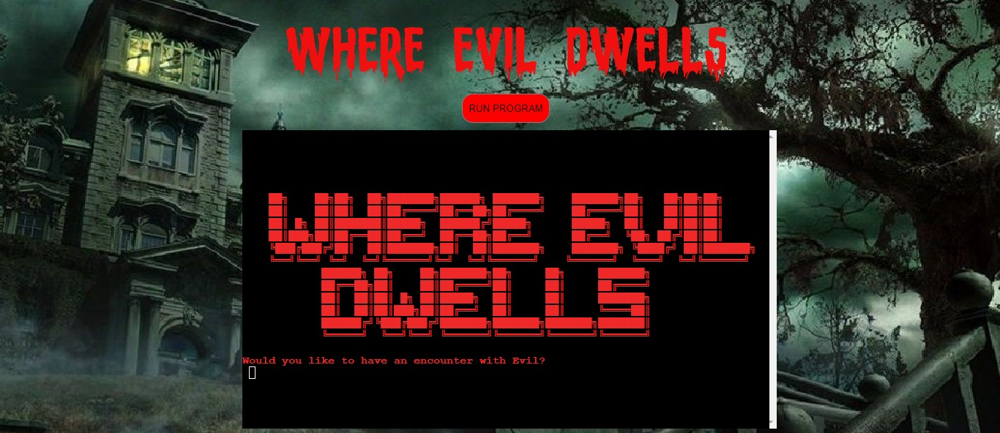
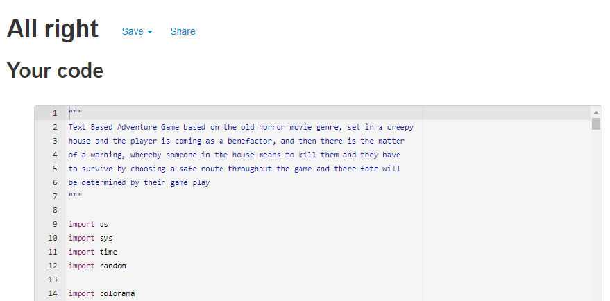
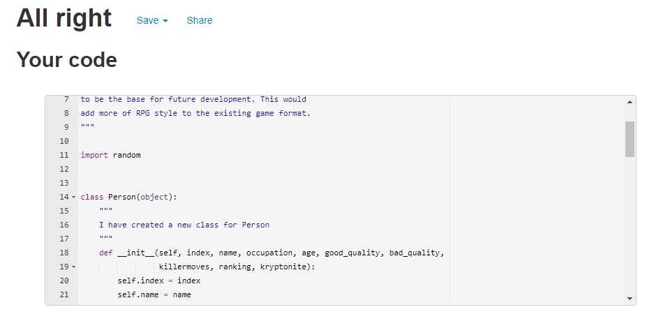
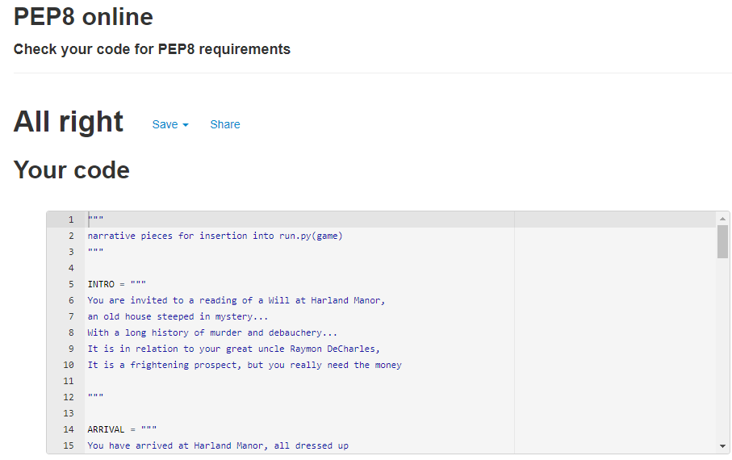
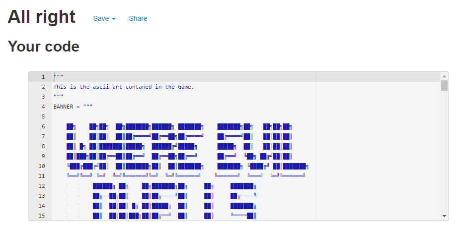
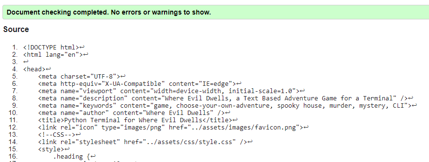

# Where Evil Dwells: Milestone 3 Project

      
         

   

 
## Introduction 
Where Evil Dwells is a Text Based Adventure for a Command Line Interface. It is utilizing the python language.
The Game is a murder mystery based in a Creepy House. The Player acts as the protagonist and will drive the direction of the game. The decision making will allow the player to interact with characters and can experience different scenarios according to their choices. This is an original story based on the vintage horror/thriller genre with inspiration from the classic movie, 'Murder by Death'. The goal of the game is to make it to the end of the game alive and be able to claim the inheritance. The hope is that the game will offer the player an interactive and fun experience, that they can repeat and experience differently each time they play 

 

[Visit the Where Evil Dwells Site](https://where-evil-dwells.herokuapp.com/)  

[Visit the Where Evil Dwells Repository](https://github.com/MHickey2/Where-Evil-Dwells)  
     

# Table of Contents 

1. [UX Strategy](#uxstrategy)
    1. [Business Goals](#businessgoals)
    2. [Target Customer](#targetcustomer)
2. [User Stories](#userstories)
    1. [First Time User](#firsttimeuser)
    2. [Regular User](#regularuser)
    3. [Site Owner](#siteowner)
3.  [Layout and Logic](#layout)
    1. [Colour Scheme](#colourscheme)
    2. [UX experience](#UX)
    3. [Graphics](#graphics)
4.  [Flow Chart for Game](#flowchart)        
5.  [Features](#features)
    1. [Index Page](#intropage)    
6.  [Future Implementation](#future)
7.  [Tools and Technology](#technology)
8.  [Testing](#testing)
    1. [Manual Tesing](#manual)
    2. [Browser Testing](#browser)
    3. [Validation](#validation)
9. [Bugs and Issues](#bugs)
    1. [Resolved](#resolved)
    2. [Unresolved](#unresolved)
10. [Deployment](#deployment)
    1. [Make Local Clone](#clone)
    2. [Forking](#fork)
    3. [Student Template](#studenttemplate)
    4. [Deploying to Heroku](#heroku)
11.  [Credits](#credits)
12.  [Acknowledgements](#acknowledgements)

----

## UX Strategy 

  

### The Business Goals of the Website: 
- No commercial goals, but the site's goal is to to provide an interactive 'Choose your Own Adventure'.
  
    

### The Target Customer: 

- The audience of the site could encompass a number of age groups and there would generally not be any   limitation on who could not play.   
       
- Would probably require some access to digital technology(not mobile).      
- May be useful for a user who has spare time and enjoys using decision making to solve a mystery.      
- Someone who likes interaction in their gaming.      

    

 #### [Return to Table of Contents](#toc)
----
## User Stories  
### As a first time user to this site, I want to …..
- Understand how the Game Works.
- Play the Game.
- If I want to restart a Game, I want to be able to do this easily.
  

   

### As a regular user of the site, I want to …...    
- I want to try the various scenarios to navigate through the game.   
    
- I want to avail of all the options to have different experiences.        
- I want more complexity and a greater range of scenarios within the game.       
   

  

### As the site owner, I want to …..    
- Build more complexity in the game, so it is more challenging to the user.
- Add more scenarios to give the user a wider range of experiences.
- Offer a wider range of settings within the game.
- In the present game, the killer is picked at random, so clues would be unhelpful, 
 but in future games, clues and red herrings could be added to create more of an 
 investigative  experience, where the killer can be identified by the player.
- Provide the user with more decision making opportunities.
  

     
----
## Layout   

 

## Colour Scheme      
The colour scheme encompasses the html index page and the terminal screen. I wanted to have a background image that resonates with the theme of the game. I simply applied a background image of a creepy house. In regards to the interface i added aasci art images to supplement the settings depicted in the text. The background colours were used to make certain elements stand out i.e. the letter. Colour was applied to text input lines, to make them stand out from the rest of the text flow.

## UX Experience    
- The Player is given a backstory on what they need to do in the game.
- The player is prompted when a decision needs to be made.
- The prompts are designed to stand out from the rest of the text.
- Validation allows the Player multiple attempts of getting inputs right. 
   

## Graphics    

 

### ABOUT BLOODY CAMP TRIAL FONT: 
Bloody Camp is a horror blood font, which creates a horror tone and felt it supplemented the
horror theme of the game. I tried to accentuate the horror mode by selecting a nice rich font
that is a true type font, and I used it as an image one the site. The site allowed you to set
the color and scale of the image.

 

      
         

  

The background image was sourced again to supplement the horror theme and the setting of the
game is in a house so I thought it was fitting that the user can visualize the type of setting that the game is depicting.

There rest of the images consist of aasci art sourced from an online generator and a free
resource that contains different categories of images, I choose images that set the scene for various settings within the game. I did not overdo this as I didn't want to distract the player too much from game play.

 #### [Return to Table of Contents](#toc)
----

## Flow Chart for the Game  

I created a flow chart in Draw.io, which helped me to focus on how the game should flow. The first stage of the
game is the intro where the user gets information on how to play the game, there is a little exploration of the
settings and the hook would be the warning, which steers the player to make decisions that will set their course for future play. There are 4 main paths that the player can chose, where the user will have a customized experience and the the end result will be revealed to the user.
  

 #### [Return to Table of Contents](#toc)
----
## Features  

### Start Page

      
         

  

The Introduction to the Game shows the Banner for the game and an invite to start the game, initially asking
whether the user wants to play the game.

 #### [Return to Table of Contents](#toc)
----
 ## Future Implementation  

 The game is set within a house, so there are limitation in regards to location, but there is
 scope to encompass more settings witin future iterations. The player could choose to travel
 to far off locations and explore different terrains and mix with a greater range of people.
 Within the present game the killer is randomly chosen so in regards to clues, these were not
 practical. In future work a killer could be chosen deliberately and clues could be provided 
 so that the user could detect the culprit and stop him from the final attack. You could chose
 to solve tasks and be rewarded with various clues to the identity of the killer, in this way
 you could add more comlexity to the game and increase the engagement of the player.

 In the present game there are only 6 characters(including the player) and there are 4 character 
 paths, you could also include further characters and more character paths to give
 the player more routes through the game. THe different character paths could also be longer
 and this would allow the player to experience a broader experience of the game.

 #### [Return to Table of Contents](#toc)
----
 ## Tools and Technology  

### Language Used:

-   [Python 3.8.10](https://www.python.org/)
-   [HTML5](https://en.wikipedia.org/wiki/HTML5)	&nbsp; [CSS3](https://en.wikipedia.org/wiki/CSS)

### Technology Used:

-   [Git:](https://git-scm.com/) used for version control, updated changes and commited changes and this in turn updated in Heroku 
-   [GitHub:](https://github.com/) is the respository for all the git pushes.
-   [Gitpod](https://gitpod.io/) was the IDE Editor
-   [Heroku:](https://heroku.com) used to deploy the application.
-   [Aasci Art Generator](https://www.developmenttools.com/) used to create Banner Heading.
-   [Desktop wallpaper](https://www.desktopnexus.com/)
-   [Free Fonts](https://www.fontspace.com/) used forFont Image for Start Screen
-   [Google Chrome Dev Tools](https://developer.chrome.com/docs/devtools/)
-   [Markdown](https://markdown-guide.readthedocs.io/en/latest/)
-   [Draw.io](https://drawio-app.com/)
 #### [Return to Table of Contents](#toc)
----
## Testing  

 

### Manual Testing

 

#### Feature being tested and Result                                                    

- Start Screen displays when Heroku link is used.                                     :heavy_check_mark:
- The Title displays
- Would you like an encounter with Evil? input fields - inputs work correctly
- House Image displays correctly
- Intro to Game displays
- Do you accept the invite? yes/no? - inputs work correctly

 

- Door Image displays correctly
- Arrival Details display
- Drink Image display correctly
- lounge(What do you choose to do in Lounge?)  - inputs work correctly
- You sneak out to the staircase, up or down? - inputs work correctly
- up = stranger(What do you do next, 1, 2 or 3?) - inputs work correctly
- down = doorchoice(Which door do you pick to explore, 1, 2 or 3?) - inputs works correctly
- stranger = input(What do you do next, 1, 2 or 3?) - inputs work correctly
- doorchoice = input(Explore which door, 1, 2 or 3?) - inputs work correctly
- Guest names display correctly
- Enter your name including validation - works correctly 
- Welcome Message displays correctly
- letter(Do you want to see what is in the letter? yes/no) - inputs works correctly
- letter displays correctly
- Review(Would you like to see details on all or 1 2 3 or 4?) - inputs works correctly
- Guest information is displayed in the right format
- Details are displayed according to user choice
- buddy_c(Now you can choose your buddy? 1, 2, 3 or 4?) - input works correctly
- If correct choice not made a buddy is assigned randomly - working correctly
- safetyitemchoice(What is your chosen protection, 1, 2, 3, 4, 5?) input works correctly
- Random Protection assignment working correctly

 

- When the Luscious path is chosen, the Luscious narration displays
- brandy = input(She offers you a glass yes/no?) - inputs work correctly
- noise = input(What choice do you pick 1 2 or 3?) - inputs work correctly
- Secret room message displays correctly
- waiting = input(What is your choice 1, 2 or 3?) - inputs work correctly
- Survival function called and the player finds if they survive - working correctly
- If player survives the Final message displays correctly
- if player dies in game, death image is shown correctly
- player is show option to leave the game - works correctly

 

- When the Brad path is chosen, the Brad narration displays
- confrontation = input(Your choice 1, 2 or 3?) - inputs work correctly
- cellar = input(What is your choice, A, B or C?) - inputs work correctly
- Survival2 function called and the player finds if they survive - working correctly
- If player survives the Final message displays correctly
- if player dies in game, death image is shown correctly
- player is show option to leave the game - works correctly

 

- When the Tobias path is chosen, the Tobias narration displays
- corridor(What is your course of action: A,B or C?) - inputs work correctly
- attic(What is your course of action: A,B or C?) - inputs work correctly
- Survival3 function called and the player finds if they survive - working correctly
- If player survives the Final message displays correctly
- if player dies in game, death image is shown correctly
- player is show option to leave the game - works correctly

 

- When the Camilla path is chosen, the Camilla narration displays
- door = input(What is your choice, A, B or C?) - inputs work correctly
- library = input(Your choice A, B or C?) - input works correctly
- Survival4 function called and the player finds if they survive - working correctly
- If player survives the Final message displays correctly
- if player dies in game, death image is shown correctly
- player is show option to leave the game - works correctly
 

 

## User Story Testing

  

## As a first time user to the site

- Understand how the Game Works.
- Play the Game.
- If I want to restart a Game, I want to be able to do this easily.

The game consists of a series of prompts, and the answers are highlighted to the user in advance. If
you choose to play, each stage of the game will lead you through the gameplay. If you want to restart
the game, currently you need to use the button above the game interface.

 

### As a regular user of the site, I want to …...  

- I want to try the various scenarios to navigate through the game.     
- I want to avail of all the options to have different experiences.        
- I want more complexity and a greater range of scenarios within the game.
  
As a user you can choose different paths in the game and you can choose to partner with a different buddy which
will also allow you to experience a different setting within the House. You can also take your chance with a 
random buddy or a random protection item to experience more of a game of chance.

 

### As the site owner, I want to …..    
- Build more complexity in the game, so it is more challenging to the user.
- Add more scenarios to give the user a wider range of experiences.
- Offer a wider range of settings within the game.
- In the present game, the killer is picked at random, so clues would be unhelpful, 
 but in future games, clues and red herrings could be added to create more of an 
 investigative  experience, where the killer can be identified by the player.
- Provide the user with more decision making opportunities.

The current game has a good foundation for future development. The classes can be utilizied to increase
the complexity. The house has a few rooms at the moment but there is the possibility of increasing the range of the current internal settings. Increase the characters and lengtening the paths within the game.

 

### Browser Testing

The site was tested on Google Chrome, Firefox and Microsoft edge, and there seemed to be no
issues on any of the browsers.

 

### Validation

I used pep8 validation to test the 4 pages and no errors were found (See images below)

      
         

  

      
         

  

      
         

  

      
         

  

 

#### HTML Checker

I tested the index page with W3C checked and it validated cleanly. I had added the css file in an 
external file but it didn't work in Heroku and so left css inline.

      
         

 

 #### [Return to Table of Contents](#toc)
----
 ## Bugs and Issues  

 ### Resolved 

 ### Unresolved 

 #### [Return to Table of Contents](#toc)
----
 ## Deployment 

 ### How to make a local Clone 
1. Navigate to the main page of the repository.
2. Click the green Code Button at top right of the repository.
3. Copy the url for the repository.
4. Open Git Bash and Change the current working directory to where you want the cloned directory.
5. Type git clone, and then paste the URL you previously copied using $ git clone. 
6. Pressing enter will then create your clone.  

   

### How to fork a GitHub Repository 
1. Log into GitHub and go to the required Repository.
2. The Fork button is found at the top right corner of the page.
3. When you click this button you will have a copy of the repository in your own GitHub account.  

   

 ### Student Template 
 This Template has been provided by the Code Institute and includes a number of tools to make life easier and has been used within this present site.    

 

### Deploying to Heroku 
- After registering on the Heroku site, you can see the dashboard. You can select 'New' and then click 'Create new app'. You need to pick a unique name for your app, it will let you know if it is  to available to use.
- Select your region and create your app.
- Go to the settings tab and scroll until you find the config vars section and pick 'Reveal config vars',
in this case I added 'PORT' into the key field and added '8000' into the value field and click 'add'.
- If you have credentials, for your project, you must create another config vars called 'CREDS' and 
you would paste the JSON into the value field.
- You have to to the builldpacks section and click 'add buildpack'.
- In this case I added 'Python' and 'saved changes, and did the same with 'Node'.
- Next you go to the Deploy tab and you select 'github' and confirm connection to your GitHub Account.
- You search for your project repository and click to 'connect'.
- Under the deploy options, you can chose automatic deploys, this allow you to automatically deploy each
time you push to your Repository.
- To deploy, you would choose what branch you want to deploy and click on 'Deploy Branch'.
- It takes a little time to build your app but when it is ready you can open your app by using the link
provided
  
  

 
#### [Return to Table of Contents](#toc)
----
 ## Credits 
 Choose Your Own Adventure Game in Python (Beginners) [Tutorial](https://www.youtube.com/watch?v=DEcFCn2ubSg)

 Python Text Based Adventure Game Tutorial [Tutorial](https://www.youtube.com/watch?v=u8X6TiJA8as&t=186s)
 
 Simple Python Project | Text-Based Adventure Game: Time Unraveled [Tutorial](https://www.youtube.com/watch?v=ypNFNr72Xe8&t=2173s)

 Let's Make a Text Adventure Game In Python  [Tutorial](https://www.youtube.com/watch?v=HzDcKq2NDwM&t=1603s)

I also used the following online resources:
- [Code Institute](https://codeinstitute.net/ie/)
- [Slack](https://slack.com/intl/en-ie/) 
- [Stack OverFlow](https://stackoverflow.com)
#### [Return to Table of Contents](#toc)
----
 ## Acknowledgements 

 Thank you to my mentor Brian Macharia for his guidance and support.

 #### [Return to Table of Contents](#toc) 

 